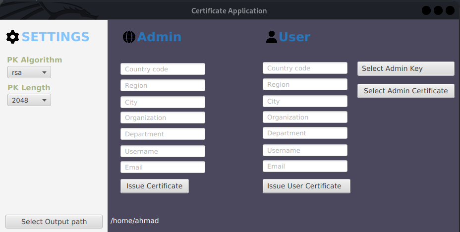

# openssl-certificate-java-fx

- This is a desktop application to create certificates for companies and sign over key with their certificate

### Tools

- JavaFX
- [Scene Builder](https://gluonhq.com/products/scene-builder/)
- Openssl cli commands

### Features

- Create certificates 
- Show key bit length
- Shows key creation algorithm(rsa)

### Screenshots

